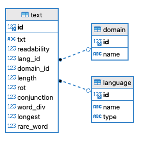

# Readability App


 [](#contributors-)

"Readability" is a webapp measures readability both English and Korean using "XGBoost"

## Structure
```shell
readability_project
┖ readability_app
  ┖ models                    # Flask-SQLAlchemy Table 
    ┖ domain_table.py
    ┖ language_table.py
    ┖ text_table.py
  ┖ routes                    # Flask routes 
    ┖ metrics_route.py         
    ┖ main_route.py        
    ┖ refernce_route.py                
  ┖ static
    ┖ src                     # Javascript File 
      ┖ bootstrap.js 
      ┖ typewrite.js 
    ┖ form.css                # Input form css 
    ┖ style.css               # Global css 
    ┖ table.css               # Table css                 
  ┖ templates         
    ┖ about.html              
    ┖ base.html               # Base template     
    ┖ editor.html             # English/Korean predict Editor
    ┖ error.html              
    ┖ index.html              # Landing Page
    ┖ refernce.html           # Search, Delete 
    ┖ under_construction.html       
  ┖ utils       
    ┖ readability_pred.py     
  ┖ __init__.py               # webapp initializer       
  ┖ config.py                 # Configuration       

```
## Schema


## Stack

### front-end

   

### back-end
 


## ToDo
- [] Make Korean model 
- [] improve english model
- [] publish via server